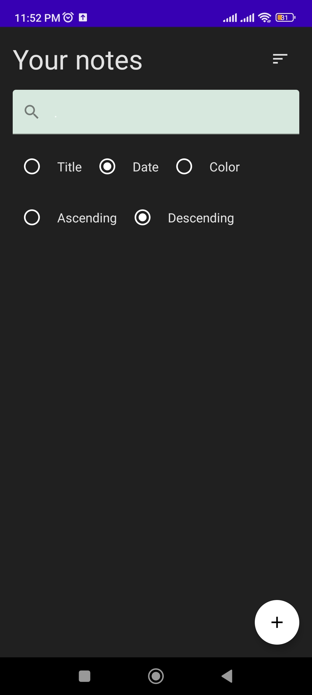
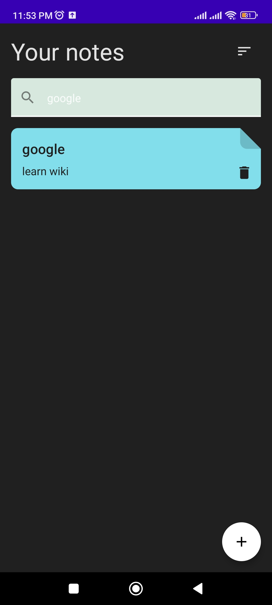
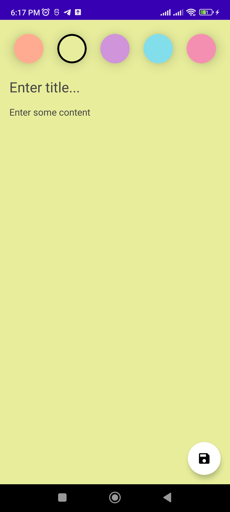
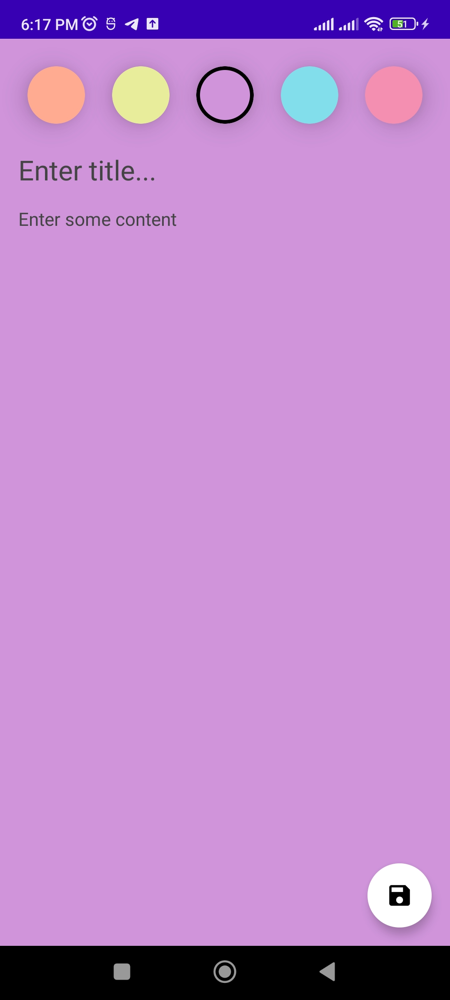

# 📝 Note App


A beautiful, colorful, and intuitive note-taking Android application built entirely with **Kotlin** and **Jetpack Compose**. Designed using the robust **MVVM (Model-View-ViewModel)** architecture, this app allows users to easily capture their thoughts, organize them with colors, and find them quickly using powerful search and sorting features.

## 🔗 Link to Application
- [Download the App (APK)](https://play.google.com/store/apps/details?id=com.bm.docathome.noteapp&pcampaignid=web_share)

## ✨ Features
- **Create & Manage Notes:** Easily add, view, and delete your notes with a single tap.
- **Color Coding:** Personalize your notes by choosing from 5 distinct pastel colors (Orange, Yellow, Purple, Blue, Pink). The note creation screen dynamically adapts its background to your chosen color!
- **Smart Search:** Quickly find specific notes using the built-in search bar.
- **Advanced Sorting:** Organize your notes your way. Filter and sort by:
  - Title
  - Date
  - Color
- **Flexible Ordering:** View your sorted notes in either **Ascending** or **Descending** order.
- **Modern UI/UX:** Clean, dark-themed main interface with vibrant, color-coded note cards built declaratively.

## 📸 Screenshots

Here is a glimpse of the application's interface:
| Home Screen (Sort Options) | Home Screen (With Notes) | Create Note (Yellow) | Create Note (Purple) |
| :---: | :---: | :---: | :---: |
|  |  |  |  |

## 🛠️ Tech Stack & Architecture

- **Language:** [Kotlin](https://kotlinlang.org/)
- **UI Toolkit:** **Jetpack Compose** for building native Android UI in a modern, declarative way.
- **Architecture:** **MVVM (Model-View-ViewModel)** pattern to ensure a clean separation of concerns, making the codebase scalable, testable, and easy to maintain.
- **Platform:** Android
- **UI Design:** Material Design principles with a custom dynamic color palette.

## 🚀 Getting Started

To run this project locally on your machine, follow these steps:

### Prerequisites
- [Android Studio](https://developer.android.com/studio)
- Android SDK

### Installation
1. Clone the repository:
   ```bash
   git clone https://github.com/Mohamed-Nafae/Note-App.git
   ```
2. Open the project in Android Studio.
3. Allow Gradle to sync and download the necessary dependencies.
4. Build and run the application on an Android emulator or a physical device.

## 🌟 A Quick Note
I hope you find this project useful! Feel free to grab whatever you want from this repository—whether it's copying snippets of code,
adopting the architecture, or using the entire app as a template for your own future projects.
I would be really thankful and happy if this helps you in your development journey!

## 📄 License
This project is open-source and available under the [MIT License](https://opensource.org/license/MIT).
